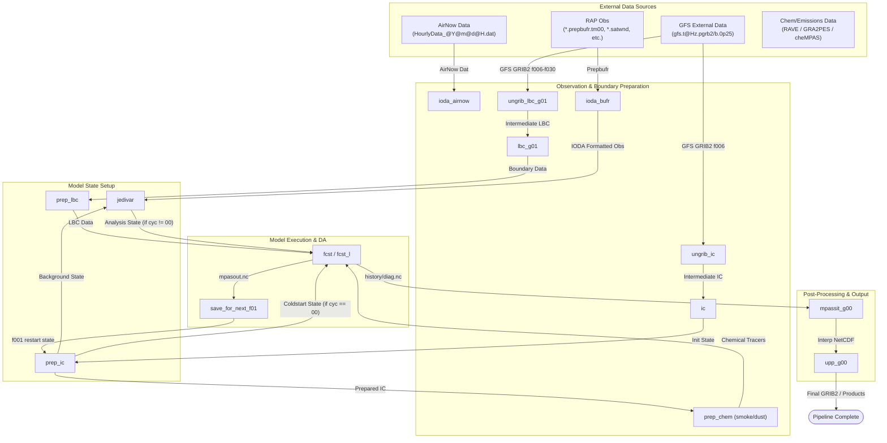

```mermaid
graph TD
    subgraph External_Inputs [External Data Sources]
        Ext_AirNow["AirNow Data<br/>(HourlyData_@Y@m@d@H.dat)"]
        Ext_Prepbufr["RAP Obs<br/>(*.prepbufr.tm00, *.satwnd, etc.)"]
        Ext_GFS["GFS External Data<br/>(gfs.t@Hz.pgrb2/b.0p25)"]
        Ext_Chem["Chem/Emissions Data<br/>(RAVE / GRA2PES / cheMPAS)"]
    end

    subgraph Ingestion_and_Prep [Observation & Boundary Preparation]
        ioda_airnow["ioda_airnow"]
        ioda_bufr["ioda_bufr"]
        ungrib_ic["ungrib_ic"]
        ungrib_lbc["ungrib_lbc_g01"]
        ic["ic"]
        lbc["lbc_g01"]
        prep_chem["prep_chem (smoke/dust)"]
    end

    subgraph State_Prep [Model State Setup]
        prep_ic["prep_ic"]
        prep_lbc["prep_lbc"]
        jedivar["jedivar"]
    end

    subgraph Core_Execution [Model Execution & DA]
        fcst["fcst / fcst_l"]
        save_f01["save_for_next_f01"]
    end

    subgraph Post_Processing [Post-Processing & Output]
        mpassit["mpassit_g00"]
        upp["upp_g00"]
    end

    Ext_AirNow -->|AirNow Dat| ioda_airnow
    Ext_Prepbufr -->|Prepbufr| ioda_bufr
    Ext_GFS -->|GFS GRIB2 f006| ungrib_ic
    Ext_GFS -->|GFS GRIB2 f006-f030| ungrib_lbc

    ungrib_ic -->|Intermediate IC| ic
    ungrib_lbc -->|Intermediate LBC| lbc

    ic -->|Init State| prep_ic
    lbc -->|Boundary Data| prep_lbc
    
    prep_ic -->|Prepared IC| prep_chem
    prep_ic -->|Background State| jedivar
    ioda_bufr -->|IODA Formatted Obs| jedivar

    prep_lbc -->|LBC Data| fcst
    jedivar -->|"Analysis State (if cyc != 00)"| fcst
    prep_ic -->|"Coldstart State (if cyc == 00)"| fcst
    prep_chem -->|Chemical Tracers| fcst

    fcst -->|mpasout.nc| save_f01
    save_f01 -->|f001 restart state| prep_ic
    
    fcst -->|history/diag.nc| mpassit
    mpassit -->|Interp NetCDF| upp
    upp -->|Final GRIB2 / Products| EndNode([Pipeline Complete])
```
