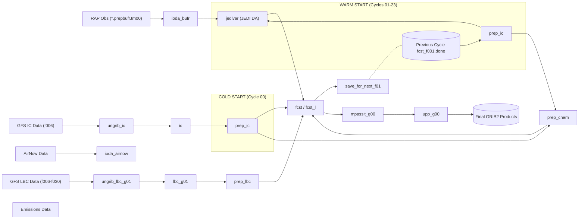

```mermaid
flowchart LR
    AirNow["AirNow Data"]
    RAP["RAP Obs (*.prepbufr.tm00)"]
    GFS_IC["GFS IC Data (f006)"]
    GFS_LBC["GFS LBC Data (f006-f030)"]
    CHEM_DATA["Emissions Data"]

    ioda_airnow["ioda_airnow"]
    ioda_bufr["ioda_bufr"]
    ungrib_ic["ungrib_ic"]
    ungrib_lbc["ungrib_lbc_g01"]
    ic["ic"]
    lbc_g01["lbc_g01"]
    prep_lbc["prep_lbc"]
    prep_chem["prep_chem"]

    subgraph COLD["COLD START (Cycle 00)"]
        prep_ic_cold["prep_ic"]
    end

    subgraph WARM["WARM START (Cycles 01-23)"]
        prev_f01[("Previous Cycle fcst_f001.done")]
        prep_ic_warm["prep_ic"]
        jedivar["jedivar (JEDI DA)"]
    end

    fcst["fcst / fcst_l"]
    save_f01["save_for_next_f01"]
    mpassit["mpassit_g00"]
    upp["upp_g00"]
    out_grib[("Final GRIB2 Products")]

    AirNow --> ioda_airnow
    RAP --> ioda_bufr
    GFS_IC --> ungrib_ic --> ic
    GFS_LBC --> ungrib_lbc --> lbc_g01 --> prep_lbc

    ic --> prep_ic_cold
    prep_ic_cold --> fcst

    prev_f01 --> prep_ic_warm
    prep_ic_warm --> jedivar
    ioda_bufr --> jedivar
    jedivar --> fcst

    prep_ic_cold --> prep_chem
    prep_ic_warm --> prep_chem
    prep_chem --> fcst
    prep_lbc --> fcst

    fcst --> save_f01
    save_f01 -.- prev_f01
    fcst --> mpassit --> upp --> out_grib
```
